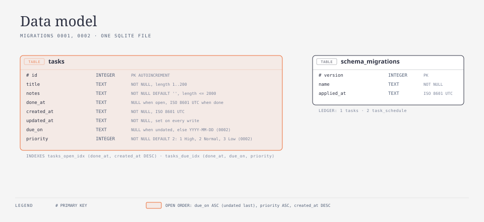
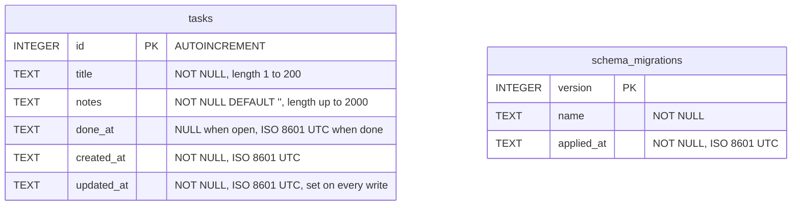

# Data model

Tier 3. Every table in the SQLite file, column by column, with the constraints the
database enforces and the ordering rules the app applies. The mechanism that creates the
tables is `how/persistence.md`.

<!-- diagram: data-model -->

The two tables are unrelated; `schema_migrations` is the ledger of what has been applied,
`tasks` is the data.

## Table `tasks`

Created by migration `0001` (`src/lib/db/migrations/0001_tasks.ts`). All timestamps are
ISO 8601 UTC strings as produced by `new Date().toISOString()`, for example
`2026-09-17T12:00:00.000Z`; SQLite has no datetime type and lexical order of this format
is chronological order.

| Column       | Type    | Constraint                                             | Meaning                                                       |
| ------------ | ------- | ------------------------------------------------------ | ------------------------------------------------------------- |
| `id`         | INTEGER | PRIMARY KEY AUTOINCREMENT                              | never reused after a delete                                   |
| `title`      | TEXT    | NOT NULL, `CHECK (length(title) BETWEEN 1 AND 200)`    | stored trimmed; the CHECK is the last line of defence         |
| `notes`      | TEXT    | NOT NULL DEFAULT `''`, `CHECK (length(notes) <= 2000)` | stored trimmed; empty string, never NULL                      |
| `done_at`    | TEXT    | NULL                                                   | NULL while the task is open; the completion time when done    |
| `created_at` | TEXT    | NOT NULL                                               | set once on insert                                            |
| `updated_at` | TEXT    | NOT NULL                                               | set on insert and on every later write, including done/reopen |

`length()` in SQLite counts characters, not bytes, so the limits match the validation
rules in `src/lib` (title 1 to 200, notes 0 to 2000 characters after trimming).

### Index

| Index            | Definition                           | Serves                                                                 |
| ---------------- | ------------------------------------ | ---------------------------------------------------------------------- |
| `tasks_open_idx` | `ON tasks(done_at, created_at DESC)` | the open list (`done_at IS NULL`, newest first) and the done list scan |

### Ordering rules

| List | Filter                | Order                      |
| ---- | --------------------- | -------------------------- |
| open | `done_at IS NULL`     | `created_at DESC, id DESC` |
| done | `done_at IS NOT NULL` | `done_at DESC, id DESC`    |

`id DESC` is the tie-breaker when two rows share a timestamp.

### Domain type

Rows map to `Task` in `src/lib/tasks/types.ts`, camel-cased: `id`, `title`, `notes`,
`doneAt` (`string | null`), `createdAt`, `updatedAt`. Input to create or update a task is
`TaskInput = { title: string; notes: string }`.

## Table `schema_migrations`

Created by `applyMigrations` (`src/lib/db/migrate.ts`) on every open, `IF NOT EXISTS`.

| Column       | Type    | Constraint  | Meaning                                                |
| ------------ | ------- | ----------- | ------------------------------------------------------ |
| `version`    | INTEGER | PRIMARY KEY | the migration's `version`                              |
| `name`       | TEXT    | NOT NULL    | the migration's `name`                                 |
| `applied_at` | TEXT    | NOT NULL    | ISO 8601 UTC, `new Date().toISOString()` at apply time |

### Migration ledger

| Version | Name    | File                                  | Creates                         |
| ------- | ------- | ------------------------------------- | ------------------------------- |
| 1       | `tasks` | `src/lib/db/migrations/0001_tasks.ts` | `tasks`, index `tasks_open_idx` |
