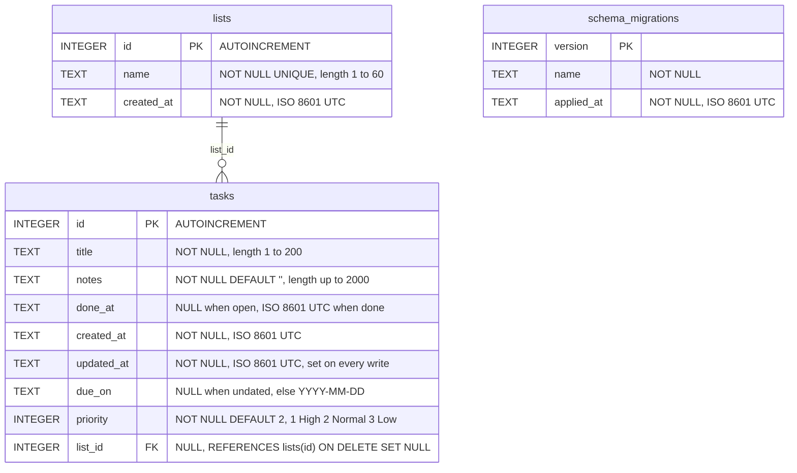

# Data model

Tier 3. Every table in the SQLite file, column by column, with the constraints the
database enforces and the ordering rules the app applies. The mechanism that creates the
tables is `how/persistence.md`.

<!-- diagram: data-model -->

`tasks` and `lists` are the data: a task belongs to at most one list (`tasks.list_id`,
NULL for "No list"), and deleting a list sets its tasks' `list_id` to NULL.
`schema_migrations` is the ledger of what has been applied and is unrelated to both.

## Table `tasks`

Created by migration `0001` (`src/lib/db/migrations/0001_tasks.ts`); `due_on` and
`priority` added by migration `0002` (`src/lib/db/migrations/0002_task_schedule.ts`),
`list_id` by migration `0003` (`src/lib/db/migrations/0003_lists.ts`), which is why they
come last, in that order, in `PRAGMA table_info(tasks)`. All timestamps are
ISO 8601 UTC strings as produced by `new Date().toISOString()`, for example
`2026-09-17T12:00:00.000Z`; SQLite has no datetime type and lexical order of this format
is chronological order.

| Column       | Type    | Constraint                                             | Meaning                                                                                                                                    |
| ------------ | ------- | ------------------------------------------------------ | ------------------------------------------------------------------------------------------------------------------------------------------ |
| `id`         | INTEGER | PRIMARY KEY AUTOINCREMENT                              | never reused after a delete                                                                                                                |
| `title`      | TEXT    | NOT NULL, `CHECK (length(title) BETWEEN 1 AND 200)`    | stored trimmed; the CHECK is the last line of defence                                                                                      |
| `notes`      | TEXT    | NOT NULL DEFAULT `''`, `CHECK (length(notes) <= 2000)` | stored trimmed; empty string, never NULL                                                                                                   |
| `done_at`    | TEXT    | NULL                                                   | NULL while the task is open; the completion time when done                                                                                 |
| `created_at` | TEXT    | NOT NULL                                               | set once on insert                                                                                                                         |
| `updated_at` | TEXT    | NOT NULL                                               | set on insert and on every later write, including done/reopen                                                                              |
| `due_on`     | TEXT    | NULL                                                   | NULL when undated; else a calendar date `YYYY-MM-DD`, validated in `src/lib` (real date, round-trips through `new Date(v + "T00:00:00Z")`) |
| `priority`   | INTEGER | NOT NULL DEFAULT `2`, `CHECK (priority IN (1, 2, 3))`  | `1` High, `2` Normal, `3` Low (`PRIORITY_LABELS` in `src/lib/tasks/validate.ts`)                                                           |
| `list_id`    | INTEGER | NULL, `REFERENCES lists(id) ON DELETE SET NULL`        | NULL for "No list"; else the owning list. Enforced because `openDatabase` sets `PRAGMA foreign_keys = ON`; an unknown id fails the insert  |

`length()` in SQLite counts characters, not bytes, so the limits match the validation
rules in `src/lib` (title 1 to 200, notes 0 to 2000 characters after trimming).

### Indexes

| Index            | Definition                            | Serves                                                     |
| ---------------- | ------------------------------------- | ---------------------------------------------------------- |
| `tasks_open_idx` | `ON tasks(done_at, created_at DESC)`  | the done list scan (`done_at IS NOT NULL`, `done_at DESC`) |
| `tasks_due_idx`  | `ON tasks(done_at, due_on, priority)` | the open list (`done_at IS NULL`, due date then priority)  |
| `tasks_list_idx` | `ON tasks(list_id)`                   | the `listId` filter and the per-list open counts           |

### Ordering rules

| List | Filter                | Order                                                                      |
| ---- | --------------------- | -------------------------------------------------------------------------- |
| open | `done_at IS NULL`     | `(due_on IS NULL) ASC, due_on ASC, priority ASC, created_at DESC, id DESC` |
| done | `done_at IS NOT NULL` | `done_at DESC, id DESC`                                                    |

Open tasks: dated tasks first, earliest due date first, then High before Normal before
Low, then newest first; undated tasks follow, by priority and then newest first. `id DESC`
is the tie-breaker when two rows share a timestamp.

`listTasks(db, filter)` takes
`ListFilter = { show?: "open" | "done" | "all"; q?: string; listId?: number }`:
`show` (default `"open"`) decides which of the two lists are queried (the other is `[]`);
`q`, trimmed and non-empty, adds `AND lower(title) LIKE '%' || lower(?) || '%'` to both;
`listId`, when a number, adds `AND list_id = ?` to both (`undefined` means every task;
`null` is not a filter value).

### Domain type

Rows map to `Task` in `src/lib/tasks/types.ts`, camel-cased: `id`, `title`, `notes`,
`dueOn` (`string | null`), `priority` (`Priority = 1 | 2 | 3`), `listId` (`number | null`),
`doneAt` (`string | null`), `createdAt`, `updatedAt`. Input to create or update a task is
`TaskInput = { title: string; notes: string; dueOn: string | null; priority: Priority; listId: number | null }`.

"Overdue" is not a column: `isOverdue(task, today)` in `src/lib/tasks/repository.ts` is
true when `doneAt` is `null`, `dueOn` is set and `dueOn < today` as `YYYY-MM-DD` strings;
the caller passes `today`.

## Table `lists`

Created by migration `0003` (`src/lib/db/migrations/0003_lists.ts`).

| Column       | Type    | Constraint                                                | Meaning                                                                                |
| ------------ | ------- | --------------------------------------------------------- | -------------------------------------------------------------------------------------- |
| `id`         | INTEGER | PRIMARY KEY AUTOINCREMENT                                 | never reused after a delete                                                            |
| `name`       | TEXT    | NOT NULL, UNIQUE, `CHECK (length(name) BETWEEN 1 AND 60)` | stored trimmed; UNIQUE is case-sensitive, so `Groceries` and `groceries` are two lists |
| `created_at` | TEXT    | NOT NULL                                                  | set once on insert                                                                     |

### Rules

`listLists(db)` orders by `name COLLATE NOCASE ASC, id ASC`. Both `listLists` and
`getList` compute `openCount` per row as
`(SELECT count(*) FROM tasks WHERE tasks.list_id = lists.id AND tasks.done_at IS NULL)`;
it is not a column. `createList(db, name)` throws SQLite's
`UNIQUE constraint failed: lists.name` on a duplicate; `isDuplicateListError(error)` in
`src/lib/lists/repository.ts` recognises that message. `deleteList(db, id)` removes the
row; the foreign key sets the list's tasks' `list_id` to NULL and keeps the tasks.

### Domain type

Rows map to `List` in `src/lib/lists/types.ts`:
`List = { id: number; name: string; createdAt: string; openCount: number }`. The name
rule lives in `src/lib/lists/validate.ts`: `parseListName(raw)` trims, requires 1 to
`LIST_NAME_MAX = 60` characters, messages `List name is required.` and
`List name must be 60 characters or fewer.`; `DUPLICATE_LIST_MESSAGE` is
`A list with that name already exists.`

## Table `schema_migrations`

Created by `applyMigrations` (`src/lib/db/migrate.ts`) on every open, `IF NOT EXISTS`.

| Column       | Type    | Constraint  | Meaning                                                |
| ------------ | ------- | ----------- | ------------------------------------------------------ |
| `version`    | INTEGER | PRIMARY KEY | the migration's `version`                              |
| `name`       | TEXT    | NOT NULL    | the migration's `name`                                 |
| `applied_at` | TEXT    | NOT NULL    | ISO 8601 UTC, `new Date().toISOString()` at apply time |

### Migration ledger

| Version | Name            | File                                          | Creates                                                         |
| ------- | --------------- | --------------------------------------------- | --------------------------------------------------------------- |
| 1       | `tasks`         | `src/lib/db/migrations/0001_tasks.ts`         | `tasks`, index `tasks_open_idx`                                 |
| 2       | `task_schedule` | `src/lib/db/migrations/0002_task_schedule.ts` | columns `tasks.due_on`, `tasks.priority`, index `tasks_due_idx` |
| 3       | `lists`         | `src/lib/db/migrations/0003_lists.ts`         | table `lists`, column `tasks.list_id`, index `tasks_list_idx`   |
