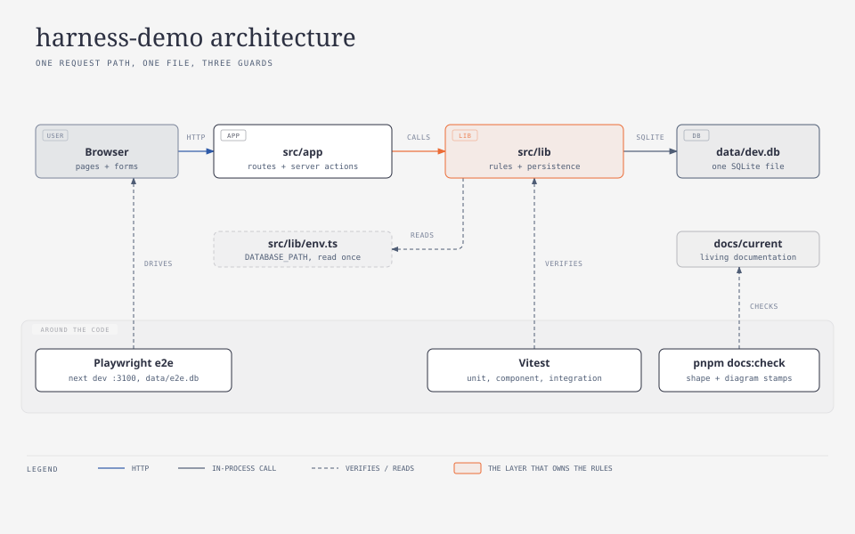
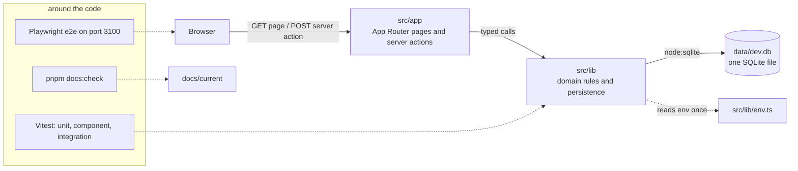

# Architecture

Tier 2. What the app is made of and where the boundaries are. For whoever is about to
place a change and needs to know which layer owns it, and what runs around the code to
keep it honest.

<!-- diagram: architecture -->

## Key entry points

| Concern                                               | Where                                                            |
| ----------------------------------------------------- | ---------------------------------------------------------------- |
| The root layout and the home page                     | `src/app/layout.tsx` → `RootLayout`, `src/app/page.tsx` → `Home` |
| The one reader of the environment                     | `src/lib/env.ts` → `readEnv`, `DEFAULT_DATABASE_PATH`            |
| Vitest projects (node and jsdom) and coverage floor   | `vitest.config.ts`                                               |
| Playwright web server, port and throwaway database    | `playwright.config.ts`                                           |
| Documentation guard                                   | `scripts/check-docs.mjs` → `run`, `checkDiagrams`, `checkShape`  |
| Repository rules guard (`process.env`, `node:sqlite`) | `scripts/check-rules.test.ts`                                    |
| The persistence layer's public surface                | `src/lib/db/index.ts` → `openDatabase`, `getDb`, `createTestDb`  |

## Layers

| Layer      | Owns                                                    | Never does            |
| ---------- | ------------------------------------------------------- | --------------------- |
| `src/app`  | routes, layouts, forms, server actions, revalidation    | SQL, validation rules |
| `src/lib`  | domain types, validation, repositories, migrations, env | anything React        |
| `scripts/` | repository tooling (docs guard)                         | app behaviour         |
| `e2e/`     | user-path tests                                         | unit-level assertions |

A server action in `src/app` parses form data, calls one function in `src/lib`, and
revalidates the route. Every rule about what a task may contain lives in `src/lib`, so the
integration tier can prove it without a browser.

## Persistence

One SQLite file, opened through Node's built-in `node:sqlite` (`DatabaseSync`), path from
`DATABASE_PATH` (default `data/dev.db`). Migrations are numbered TypeScript modules
(`src/lib/db/migrations/`) applied on open and recorded in `schema_migrations`. The
mechanism is `how/persistence.md`; the tables are `data-model.md`.

## Failure modes

| Symptom                                                   | Cause                                                                 | Fix                                                                          |
| --------------------------------------------------------- | --------------------------------------------------------------------- | ---------------------------------------------------------------------------- |
| `pnpm build` fails on `node:sqlite` in a client component | a client component imported from `src/lib/db`                         | import the repository only from server code (pages, actions, route handlers) |
| The app works in `pnpm dev` but e2e sees an empty list    | e2e uses a fresh `data/e2e-<timestamp>.db` per run, not `data/dev.db` | expected; the e2e test creates its own data                                  |
