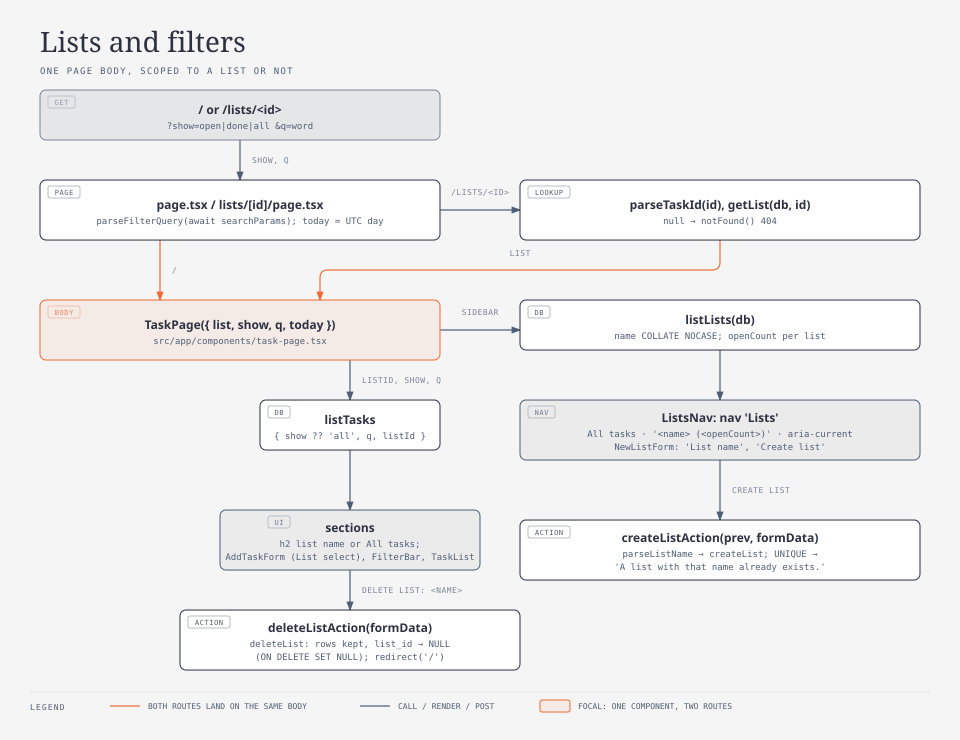
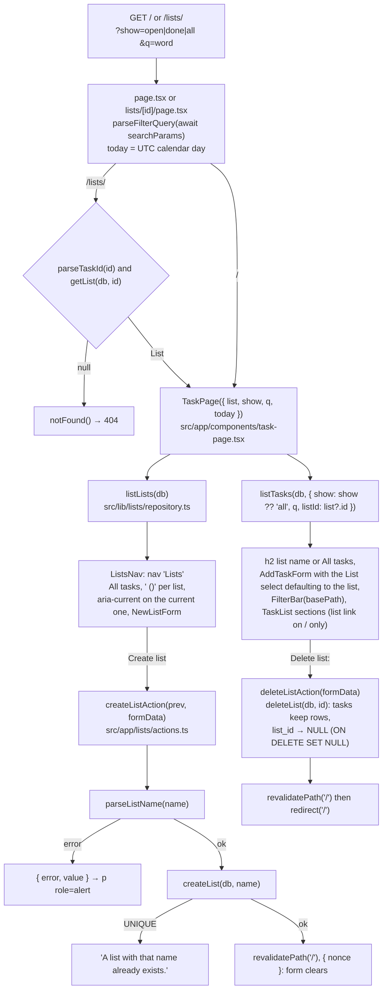

# Lists

Tier 2. Lists: the sidebar with its open counts and the New list form, the scoped page
`/lists/<id>`, the List select on both task forms, the list link on a row, and deleting
a list. For whoever is about to change the sidebar, a list page, the create-list or
delete-list action, the list name rule, or how the filter bar and the forms behave
inside a list. The filter bar itself (`show`, `q`) is `how/scheduling.md`.

<!-- diagram: lists-and-filters -->

## Key entry points

| Concern                                                        | Where                                                                                                                                       |
| -------------------------------------------------------------- | ------------------------------------------------------------------------------------------------------------------------------------------- |
| The unscoped page (`/`)                                        | `src/app/page.tsx` → `Home`, `dynamic`                                                                                                      |
| The list page (`/lists/<id>`, `params` is a Promise, 404 rule) | `src/app/lists/[id]/page.tsx` → `ListPage`, `dynamic`                                                                                       |
| The shared page body (reads lists and tasks, renders the rest) | `src/app/components/task-page.tsx` → `TaskPage`                                                                                             |
| The sidebar (links, counts, `aria-current`)                    | `src/app/components/lists-nav.tsx` → `ListsNav`                                                                                             |
| The New list form (client, `useActionState`)                   | `src/app/components/new-list-form.tsx` → `NewListForm`, `NewListFormView`                                                                   |
| The create-list and delete-list server actions                 | `src/app/lists/actions.ts` → `createListAction`, `deleteListAction`, `CreateListState`                                                      |
| The List select on both forms                                  | `src/app/components/task-fields.tsx` → `TaskFields`, `ListOption`                                                                           |
| The add form's default list and the add action's list check    | `src/app/components/add-task-form.tsx` → `AddTaskForm`, `AddTaskFormView`; `src/app/actions.ts` → `addTask`                                 |
| The edit form's lists and the save action's list check         | `src/app/tasks/[id]/edit/page.tsx` → `EditTaskPage`; `src/app/tasks/[id]/edit/actions.ts` → `saveTask`                                      |
| The list link on a row                                         | `src/app/components/task-list.tsx` → `TaskList`                                                                                             |
| The filter bar's base path                                     | `src/app/components/filter-bar.tsx` → `FilterBar`                                                                                           |
| Reading and writing lists                                      | `src/lib/lists/repository.ts` → `listLists`, `getList`, `createList`, `isDuplicateListError`, `deleteList`                                  |
| The list name rule and the duplicate message                   | `src/lib/lists/validate.ts` → `parseListName`, `LIST_NAME_MAX`, `DUPLICATE_LIST_MESSAGE`                                                    |
| The `listId` field rule and the query parameters               | `src/lib/tasks/validate.ts` → `parseListId`, `parseTaskInput`, `parseFilterQuery`, `parseTaskId`                                            |
| The `List` type                                                | `src/lib/lists/types.ts` → `List`                                                                                                           |
| Tests                                                          | `src/app/components/lists-nav.test.tsx`, `src/app/components/new-list-form.test.tsx`, `src/lib/lists/validate.test.ts`, `e2e/lists.spec.ts` |

## The two pages

`/` (`src/app/page.tsx`) and `/lists/<id>` (`src/app/lists/[id]/page.tsx`) are the same
page with a different scope. Both export `dynamic = "force-dynamic"`, await
`searchParams` and hand `parseFilterQuery(params)` (`show`, `q`; see `how/scheduling.md`)
plus `today` to `TaskPage`. The list page first awaits `params`:

| `id` in the URL                         | Result                                                      |
| --------------------------------------- | ----------------------------------------------------------- |
| a positive integer string with a list   | 200, `TaskPage` with `list` from `getList(getDb(), id)`     |
| a positive integer string, no such list | `notFound()`, the Next.js 404 page with HTTP status 404     |
| anything else (`abc`, `0`, `-1`, `1.5`) | `parseTaskId` returns `null`: `notFound()`, HTTP status 404 |

`TaskPage({ list, show, q, today, headingActions })` is a server component and the only
place the page body is written. It calls `listLists(db)` for the sidebar and
`listTasks(db, { show: show ?? "all", q, listId: list?.id })` for the sections, so the
default view rule (`show` missing renders Open and, only when it has rows, Done) holds on
both pages. It renders, inside `<main>`:

| Part          | Markup                                                                                                                                  |
| ------------- | --------------------------------------------------------------------------------------------------------------------------------------- |
| header        | the single `h1` `harness-demo` (the smoke test asserts it) and a tagline                                                                |
| sidebar       | `<ListsNav lists currentListId={list?.id ?? null} />`                                                                                   |
| heading       | `h2` with the list name on `/lists/<id>`, `All tasks` on `/`; `headingActions` next to it (the Delete list form on a list page)         |
| add form      | `<AddTaskForm lists listId={list?.id} />`: the List select defaults to the current list on a list page, to `No list` on `/`             |
| filter bar    | `<FilterBar show q basePath />` with `basePath` `/lists/<id>` or `/`, so the Open, Done, All links and the search form stay on the page |
| task sections | `<TaskList open done show q today lists />`; `lists` only on `/`, so only there a row links its list                                    |

## The sidebar

`ListsNav({ lists, currentListId })` renders `<nav aria-label="Lists">`:

| Element           | Markup                                                                                                                    |
| ----------------- | ------------------------------------------------------------------------------------------------------------------------- |
| link `All tasks`  | `href="/"`; `aria-current="page"` when `currentListId` is `null`                                                          |
| one link per list | `href="/lists/<id>"`, text `<name> (<openCount>)`, for example `Groceries (2)`; `aria-current="page"` on the current list |
| the New list form | `NewListForm`, below the links                                                                                            |

Lists come from `listLists`, ordered by `name COLLATE NOCASE ASC, id ASC`, each with
`openCount` (its tasks with `done_at IS NULL`, regardless of the current filter).

## Creating a list

`NewListForm` (`"use client"`) is `useActionState(createListAction, {})` over
`NewListFormView({ state, action })`: a `<form aria-label="New list">` keyed on
`state.nonce`, an input `name="name"` labelled `List name` with `defaultValue`
`state.value`, the error in `
`, and a button `Create list`.

`createListAction(prevState, formData)` in `src/app/lists/actions.ts` (`"use server"`):

1. `parseListName(formData.get("name"))`; on error return `{ error, value }` where
   `value` is the submitted string, so the input keeps it.
2. `createList(getDb(), name)`; when it throws and `isDuplicateListError(error)` is true,
   return `{ error: DUPLICATE_LIST_MESSAGE, value }`; any other error is rethrown.
3. `revalidatePath("/")` and return `{ nonce: Date.now() }`, which remounts the form
   empty; the sidebar shows the new list with `(0)`.

| Rule                                          | Message                                     |
| --------------------------------------------- | ------------------------------------------- |
| trimmed name empty                            | `List name is required.`                    |
| trimmed name longer than `LIST_NAME_MAX` (60) | `List name must be 60 characters or fewer.` |
| name already exists (UNIQUE, case-sensitive)  | `A list with that name already exists.`     |

`CreateListState` is `{ error?: string; value?: string; nonce?: number }`.

## The List select

`TaskFields` (`how/tasks.md`) renders, after Priority, `<select name="listId">` labelled
`List` with the option `No list` (value `""`) first and one option per list (value the
id, text the name). Both forms pass `lists: ListOption[]` (`{ id, name }`, from
`listLists`; `TaskPage` hands them to `AddTaskForm`, `EditTaskPage` to `EditTaskForm`).
The default comes from `values.listId`:

| Form               | `values.listId` before any submit                  |
| ------------------ | -------------------------------------------------- |
| add form on `/`    | `""` (`No list`)                                   |
| add form on a list | `String(list.id)`: the current list is preselected |
| edit form          | `task.listId === null ? "" : String(task.listId)`  |

After a validation error the submitted `listId` is kept like every other field. A
successful add remounts the form (new `nonce`), so the select is back on the page's list.

`addTask` (`src/app/actions.ts`) and `saveTask` (`src/app/tasks/[id]/edit/actions.ts`)
read every list id with `listLists(db)` and call
`parseTaskInput(formDataToRaw(formData), { listIds })`, so a `listId` that is not an
existing list fails with `List does not exist.` under the select like any other field
error; `""` parses to `null` (`No list`). After a write, `addTask`, `toggleTask`,
`removeTask` and `saveTask` call `revalidatePath("/")` and
`revalidatePath("/lists/[id]", "page")`, so both pages re-read the database.

## The list link on a row

On `/` `TaskPage` passes `lists` to `TaskList`, which maps `task.listId` to its name and
renders, after the row's marks (`how/scheduling.md`), `<a href="/lists/<id>"><name></a>`
on open and done rows whose task has a list. On `/lists/<id>` `lists` is not passed and
no row shows the link (every row is in that list). The link's accessible name is the
list name alone; the sidebar's link for the same list is `<name> (<openCount>)`, so a
test locating the row link uses `exact: true`.

## Deleting a list

The list page renders, next to the heading, `<form action={deleteListAction}>` with a
hidden `id` and a button whose accessible name is `Delete list: <name>`.
`deleteListAction(formData)`:

1. `parseTaskId(formData.get("id"))`; a valid id calls `deleteList(getDb(), id)`, an
   invalid one is ignored.
2. `revalidatePath("/")`, then `redirect("/")`, outside any `try/catch` (`redirect`
   throws).

`tasks.list_id` is `REFERENCES lists(id) ON DELETE SET NULL` with `PRAGMA foreign_keys = ON`
(`data-model.md`), so the list's tasks are kept and show up on `/` with no list. There
is no confirmation step.

## Tests

| Tier      | File                                         | Proves                                                                                                                                                                                                                                                                                                                                                                                                                                                                             |
| --------- | -------------------------------------------- | ---------------------------------------------------------------------------------------------------------------------------------------------------------------------------------------------------------------------------------------------------------------------------------------------------------------------------------------------------------------------------------------------------------------------------------------------------------------------------------- |
| unit      | `src/lib/lists/validate.test.ts`             | the list name rule and its messages                                                                                                                                                                                                                                                                                                                                                                                                                                                |
| unit      | `src/lib/tasks/validate.test.ts`             | `parseListId` against `listIds`; `parseFilterQuery` (`show`, trimmed `q`, first value of a repeated parameter)                                                                                                                                                                                                                                                                                                                                                                     |
| component | `src/app/components/lists-nav.test.tsx`      | the `All tasks` link and one `<name> (<openCount>)` link per list with their hrefs; `aria-current` follows `currentListId`; the form is inside the nav                                                                                                                                                                                                                                                                                                                             |
| component | `src/app/components/new-list-form.test.tsx`  | label `List name`, button `Create list`, the error alert with the kept value, a new nonce clears the input                                                                                                                                                                                                                                                                                                                                                                         |
| component | `src/app/components/filter-bar.test.tsx`     | `basePath` in the hrefs and the form action                                                                                                                                                                                                                                                                                                                                                                                                                                        |
| component | `src/app/components/task-fields.test.tsx`    | the `List` select: `No list` first then one option per list, the default from `values.listId`, the `listId` error alert                                                                                                                                                                                                                                                                                                                                                            |
| component | `src/app/components/add-task-form.test.tsx`  | the select defaults to `listId` on a list page and to `No list` on `/`; the submitted `listId` survives an error                                                                                                                                                                                                                                                                                                                                                                   |
| component | `src/app/components/edit-task-form.test.tsx` | the select shows the task's list, or `No list`                                                                                                                                                                                                                                                                                                                                                                                                                                     |
| component | `src/app/components/task-list.test.tsx`      | the list link on open and done rows when `lists` is given; no link without `lists`                                                                                                                                                                                                                                                                                                                                                                                                 |
| e2e       | `e2e/lists.spec.ts`                          | creating `Lists: Groceries` shows `Lists: Groceries (0)` in the sidebar and clears the input; on its page the select defaults to it, adding `Lists: milk` shows the row, `(1)` and, on `/`, the row link `Lists: Groceries`; editing the task to `No list` removes the link and shows `(0)`; creating the name again shows `A list with that name already exists.`; `Delete list: Lists: Groceries` lands on `/` with the task kept and no sidebar entry; `/lists/999999` is a 404 |

`e2e/lists.spec.ts` is serial, uses its own titles (`Lists: ...`) and never assumes an
empty database. It runs first alphabetically; a `test.afterAll` with its own page deletes
`Lists: milk` and, when it still exists, the list, so `tasks.spec.ts` still finds the
fresh database empty.

## Failure modes

| Symptom                                                    | Cause                                                                               | Fix                                                                                                     |
| ---------------------------------------------------------- | ----------------------------------------------------------------------------------- | ------------------------------------------------------------------------------------------------------- |
| `A list with that name already exists.`                    | `lists.name` is UNIQUE and case-sensitive                                           | pick another name; renaming is not offered (increment spec, deferred)                                   |
| `List does not exist.` under the List select               | the selected list was deleted since the form rendered                               | reload the page; the sidebar and the select are re-read from the database                               |
| a row on `/` shows no list link although the task has one  | `lists` not passed to `TaskList`, or the list was deleted (`list_id` is now NULL)   | `TaskPage` passes `lists` when `list` is `null`                                                         |
| `getByLabel("List")` matches two elements in a test        | substring match also hits the `List name` label in the sidebar                      | `getByLabel("List", { exact: true })`                                                                   |
| deleting the list you are viewing lands on `/`             | `deleteListAction` always redirects to `/`; the list's tasks are there with no list | expected                                                                                                |
| `/lists/abc` or `/lists/999999` shows the 404 page         | `parseTaskId` or `getList` returned `null`                                          | expected; the sidebar links only to existing lists                                                      |
| the New list form keeps its text after a successful create | the form is not remounted                                                           | keep `key={state.nonce}` on the form and return a new `nonce` from `createListAction`                   |
| a list page shows stale rows after a row action            | `revalidatePath("/lists/[id]", "page")` missing in the action                       | keep `revalidateTaskPages()` in every row action in `src/app/actions.ts`                                |
| `pnpm build` fails on `node:sqlite` in a client component  | `NewListForm` or another `"use client"` file imported `@/lib/db` or a repository    | only `TaskPage`, the two `page.tsx` files and the `actions.ts` files call `getDb()`; pass data as props |
