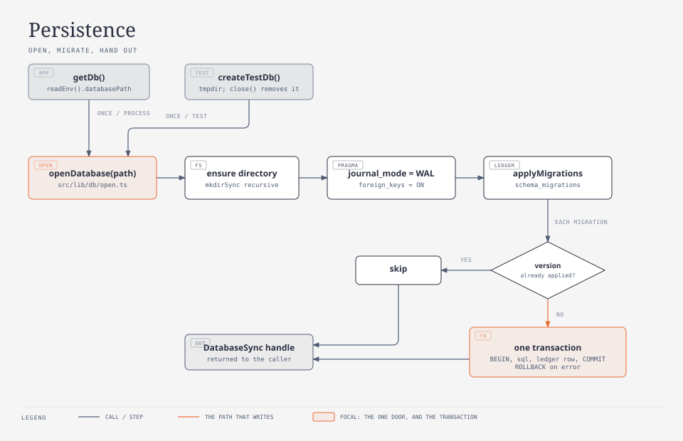
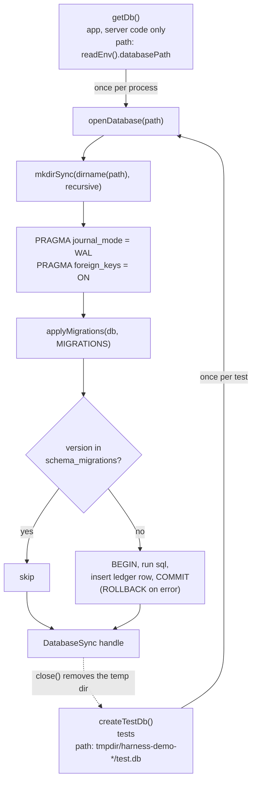

# Persistence

Tier 2. How the app opens its SQLite file, applies migrations and hands out a database
handle, and how tests get a throwaway database of their own. For whoever is about to add
a migration, change how the database is opened, or write an integration test.



<!-- diagram: persistence -->



## Key entry points

| Concern                                      | Where                                                                                                                                   |
| -------------------------------------------- | --------------------------------------------------------------------------------------------------------------------------------------- |
| Open a file, set PRAGMAs, migrate            | `src/lib/db/open.ts` → `openDatabase`                                                                                                   |
| The migration ledger and runner              | `src/lib/db/migrate.ts` → `applyMigrations`, `MIGRATIONS`, `Migration`                                                                  |
| Migration 0001, the `tasks` table            | `src/lib/db/migrations/0001_tasks.ts` → `migration0001`                                                                                 |
| Migration 0002, `due_on` and `priority`      | `src/lib/db/migrations/0002_task_schedule.ts` → `migration0002`                                                                         |
| Migration 0003, `lists` and `tasks.list_id`  | `src/lib/db/migrations/0003_lists.ts` → `migration0003`                                                                                 |
| The app's process-wide handle                | `src/lib/db/client.ts` → `getDb`                                                                                                        |
| A throwaway migrated database for tests      | `src/lib/db/test-db.ts` → `createTestDb`, `TestDb`                                                                                      |
| Public surface of the persistence layer      | `src/lib/db/index.ts` → `openDatabase`, `applyMigrations`, `MIGRATIONS`, `Migration`, `getDb`, `createTestDb`, `TestDb`, `DatabaseSync` |
| Where the file path comes from               | `src/lib/env.ts` → `readEnv`, `DEFAULT_DATABASE_PATH`                                                                                   |
| The rule that only `src/lib/db/` uses SQLite | `scripts/check-rules.test.ts`                                                                                                           |

## Opening a database

`openDatabase(path)` is the one place a SQLite file is opened. It uses Node's built-in
`node:sqlite` (`DatabaseSync`, synchronous API); there is no npm SQLite dependency. In
order it:

| Step | What                                                                     | Exact value                                         |
| ---- | ------------------------------------------------------------------------ | --------------------------------------------------- |
| 1    | creates the parent directory if missing                                  | `mkdirSync(dirname(path), { recursive: true })`     |
| 2    | opens (creates) the file                                                 | `new DatabaseSync(path)`                            |
| 3    | switches the journal to write-ahead logging                              | `PRAGMA journal_mode = WAL`                         |
| 4    | turns on foreign key enforcement for this connection                     | `PRAGMA foreign_keys = ON`                          |
| 5    | applies pending migrations                                               | `applyMigrations(db)` with the default `MIGRATIONS` |
| 6    | returns the handle; the caller owns it and calls `close()` when finished |                                                     |

WAL mode creates `<path>-wal` and `<path>-shm` next to the file while a connection is
open. Both PRAGMAs are per connection, which is why they live in `openDatabase` and not in
a migration.

## Migrations

A migration is a TypeScript module exporting `{ version, name, sql }` (type `Migration`),
not a `.sql` file, so `next build` bundles it without a file-system read at runtime.
`MIGRATIONS` in `src/lib/db/migrate.ts` lists them all; adding one means adding a file
under `src/lib/db/migrations/` and appending it to that array. An applied migration is
never edited; a change is a new migration.

`applyMigrations(db, migrations = MIGRATIONS)`:

1. `CREATE TABLE IF NOT EXISTS schema_migrations (version INTEGER PRIMARY KEY, name TEXT NOT NULL, applied_at TEXT NOT NULL)`.
2. Reads every `version` already in the table.
3. For each migration not yet recorded, ascending by `version`: `BEGIN`, `exec(sql)`,
   insert `(version, name, applied_at)` with `applied_at = new Date().toISOString()`
   (ISO 8601 UTC), `COMMIT`. On any error: `ROLLBACK`, then the error is rethrown, so a
   failed migration leaves no ledger row and the next open retries it.
4. Returns the number of migrations applied. Re-running is a no-op returning `0`.

The ledger so far is one row: `version 1`, `name tasks`. The tables are in
`data-model.md`.

## The two callers

| Caller           | Used by                                   | Path                                                                         | Lifetime                                                                                                                                                      |
| ---------------- | ----------------------------------------- | ---------------------------------------------------------------------------- | ------------------------------------------------------------------------------------------------------------------------------------------------------------- |
| `getDb()`        | server code in `src/app` (pages, actions) | `readEnv().databasePath`, the `DATABASE_PATH` env var, default `data/dev.db` | one handle per process, kept in a module variable and on `globalThis` under `Symbol.for("harness-demo.db")` so Next.js dev hot reload reuses it; never closed |
| `createTestDb()` | integration tests                         | `join(mkdtempSync(join(tmpdir(), "harness-demo-")), "test.db")`              | one per test; `close()` closes the handle and `rmSync`s the temp directory (file, `-wal` and `-shm` together)                                                 |

`getDb` must only be imported from server code: `node:sqlite` does not exist in the
browser bundle, and `pnpm build` fails on a client component that reaches it.
`scripts/check-rules.test.ts` fails `pnpm test` when a file outside `src/lib/db/` imports
`node:sqlite` or a file other than `src/lib/env.ts` reads `process.env`.

A test that needs a database:

```ts
import { createTestDb } from "@/lib/db";

const { db, close } = createTestDb();
try {
  // db is a migrated DatabaseSync on a fresh temp file
} finally {
  close();
}
```

## Failure modes

| Symptom                                                       | Cause                                                                                     | Fix                                                                                                                                                             |
| ------------------------------------------------------------- | ----------------------------------------------------------------------------------------- | --------------------------------------------------------------------------------------------------------------------------------------------------------------- |
| `SQLITE_BUSY: database is locked`                             | two processes write the same file, for example `pnpm dev` and `pnpm test:e2e` on one path | keep `data/dev.db` and the e2e file (`data/e2e-<timestamp>.db`) separate; stop the other process; never point `DATABASE_PATH` at a file another server has open |
| `SQLITE_CANTOPEN: unable to open database file`               | the path's parent is not writable, or the path is a directory                             | `openDatabase` creates missing directories, so check permissions and that `DATABASE_PATH` names a file                                                          |
| a migration fails and the app will not start                  | broken SQL in a new migration; the transaction rolled back, no ledger row was written     | fix the migration; the next open retries it. Never edit an already applied migration                                                                            |
| `pnpm build` fails on `node:sqlite` in a client component     | a `"use client"` file imported `src/lib/db` directly or transitively                      | call the repository from a page or a server action and pass plain data to the component                                                                         |
| the e2e run sees data from `pnpm dev`, or the other way round | both were pointed at the same file                                                        | e2e uses a fresh `data/e2e-<timestamp>.db` per run (`playwright.config.ts`); dev uses `data/dev.db`; reset with `rm -f data/dev.db* data/e2e-*.db*`             |
| stale `-wal` / `-shm` files next to a deleted database        | the file was removed while a connection was open                                          | remove them together with the database: `rm -f data/dev.db data/dev.db-wal data/dev.db-shm`                                                                     |
