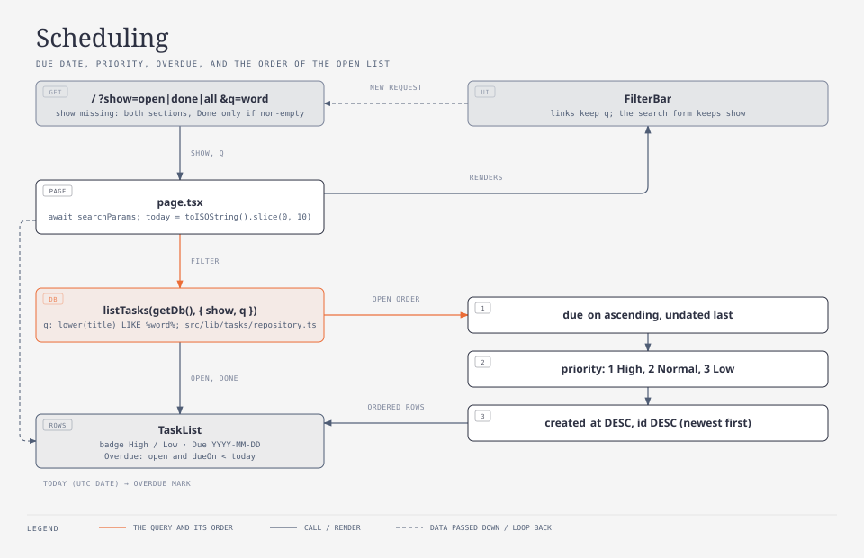
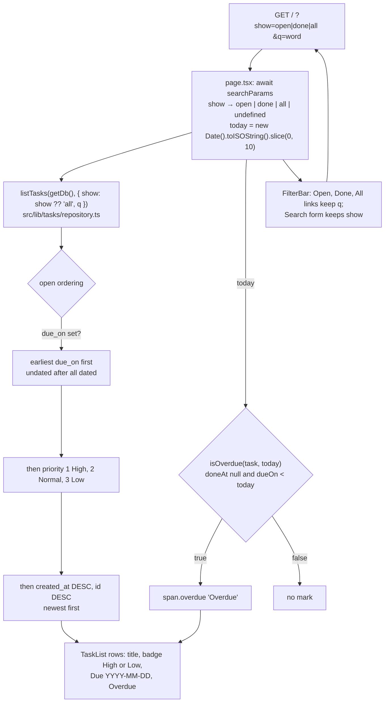

# Scheduling

Tier 2. Due dates, priority, the overdue mark, the ordering of the open list, and the
filter bar (`show` and `q`) on `/`. For whoever is about to change what a task row
shows, the order of the open list, the Open, Done and All links, the search, or the
due and priority validation.



<!-- diagram: scheduling -->



## Key entry points

| Concern                                                 | Where                                                                                                       |
| ------------------------------------------------------- | ----------------------------------------------------------------------------------------------------------- |
| Open ordering and the `show` and `q` filters (SQL)      | `src/lib/tasks/repository.ts` → `listTasks`, `ListFilter`                                                   |
| The overdue rule (pure, takes `today`)                  | `src/lib/tasks/repository.ts` → `isOverdue`                                                                 |
| Due and priority rules, messages and labels             | `src/lib/tasks/validate.ts` → `parseDueOn`, `parsePriority`, `PRIORITY_LABELS`                              |
| The Due and Priority controls on both forms             | `src/app/components/task-fields.tsx` → `TaskFields`                                                         |
| The Open, Done, All links and the search form           | `src/app/components/filter-bar.tsx` → `FilterBar`, `Show`                                                   |
| Reading `searchParams`, computing `today`, the sections | `src/app/page.tsx` → `Home`                                                                                 |
| Badge, due date and Overdue on a row; which sections    | `src/app/components/task-list.tsx` → `TaskList`                                                             |
| The `Priority` type and the `dueOn` field               | `src/lib/tasks/types.ts` → `Task`, `TaskInput`, `Priority`                                                  |
| Tests                                                   | `src/app/components/filter-bar.test.tsx`, `src/app/components/task-list.test.tsx`, `e2e/scheduling.spec.ts` |

## The fields

`TaskFields` (see `how/tasks.md`) renders `Due` as `<input type="date" name="dueOn">`
and `Priority` as `<select name="priority">`. The parsers in `src/lib/tasks/validate.ts`:

| Field      | Accepted                                                                              | Stored                        | Message                                 |
| ---------- | ------------------------------------------------------------------------------------- | ----------------------------- | --------------------------------------- |
| `dueOn`    | empty, or `YYYY-MM-DD` that round-trips through `new Date(v + "T00:00:00Z")`          | `due_on` text or `NULL`       | `Due must be a date (YYYY-MM-DD).`      |
| `priority` | missing, `null` or `""` (defaults to `2`); `"1"`, `"2"`, `"3"` or the numbers 1, 2, 3 | `priority` integer, default 2 | `Priority must be high, normal or low.` |

`2026-02-30` fails the round trip and is rejected. `PRIORITY_LABELS` is
`{ 1: "High", 2: "Normal", 3: "Low" }` and is the only source of the option labels and
the badge text.

## The query parameters

`src/app/page.tsx` awaits `searchParams` (a Promise in Next.js 16) and reads:

| Parameter | Values                | Missing or other value                                                                 | Effect                                                 |
| --------- | --------------------- | -------------------------------------------------------------------------------------- | ------------------------------------------------------ |
| `show`    | `open`, `done`, `all` | `undefined`: the default view, which reads both lists (`listTasks` gets `show: "all"`) | which sections render, see the table below             |
| `q`       | any text, trimmed     | `""`: no search                                                                        | case-insensitive substring on the title; counts follow |

A repeated parameter (`?show=a&show=b`) uses its first value.

The SQL for `q` is `lower(title) LIKE '%' || lower(?) || '%' ESCAPE '\'` on both lists.
`\`, `%` and `_` in the search text are escaped (`\` first, so the escaping backslashes
are not themselves re-escaped) before being bound, so a search for `100%` or `a_b`
matches those characters literally instead of as LIKE wildcards. Matching is a
case-insensitive substring on the title. SQLite's `lower()` folds ASCII case only, so
`mælk` does not match `MÆLK`.

The default view is deliberately not `show=open`. `e2e/tasks.spec.ts` (and the page
before the filter bar existed) expects `/` with no query to show the Open section and,
as soon as a task is marked done, the Done section too, without touching a filter. So a
missing `show` renders like `all`, with one difference: an empty Done section is omitted.
The `Open` link always carries `show=open` explicitly, and the `All` link is the current
one on the default view.

| `show`      | Open section | Done section               | Empty state paragraph                         |
| ----------- | ------------ | -------------------------- | --------------------------------------------- |
| `undefined` | yes          | only when it has rows      | when both lists are empty and `q` is `""`     |
| `open`      | yes          | no                         | never; `Open (0)` heading when it has no rows |
| `done`      | no           | yes, `Done (0)` when empty | never                                         |
| `all`       | yes          | yes, `Done (0)` when empty | when both lists are empty and `q` is `""`     |

With `q` set and no match the headings render with their counts (`Open (0)`) above an
empty list; the empty state paragraph never shows during a search. It only ever replaces
the sections on `show=undefined` or `show=all`; `open` and `done` always render their
heading with a count, even at zero.

## The filter bar

`FilterBar({ show, q })` is a server component inside `<nav aria-label="Filters">`:

| Control                     | Markup                                                                                                                         |
| --------------------------- | ------------------------------------------------------------------------------------------------------------------------------ |
| links `Open`, `Done`, `All` | `href="/?show=<value>"` plus `&q=<q>` when `q` is non-empty; the current one has `aria-current="page"`                         |
| search form                 | `<form method="get" action="/">`, hidden `show` (only when `show` is set), `input name="q"` labelled `Search`, button `Search` |

Submitting the form is a plain GET navigation, so the page re-reads the database with
the new `q`; no server action is involved.

## Ordering

The repository, not the page, orders rows (`OPEN_ORDER` in
`src/lib/tasks/repository.ts`):

```sql
ORDER BY (due_on IS NULL) ASC, due_on ASC, priority ASC, created_at DESC, id DESC
```

Dated tasks come first, earliest due date first; undated tasks follow. Within the same
due date (or among the undated) High (1) precedes Normal (2) precedes Low (3); ties are
newest first. Done tasks keep `ORDER BY done_at DESC, id DESC`. The index
`tasks_due_idx (done_at, due_on, priority)` from migration 0002 backs the open query.

## The row marks

`TaskList` renders, after the title, in this order:

| Mark      | When                                     | Markup                                         |
| --------- | ---------------------------------------- | ---------------------------------------------- |
| badge     | `priority` is 1 or 3 (Normal shows none) | `<span class="badge ...">High</span>` or `Low` |
| due date  | `dueOn` is set                           | `<span>Due 2026-09-30</span>`                  |
| `Overdue` | `isOverdue(task, today)`                 | `<span class="overdue ...">Overdue</span>`     |

`isOverdue` is `doneAt === null && dueOn !== null && dueOn < today`, a string
comparison of two `YYYY-MM-DD` values. `today` is computed once per request in
`page.tsx` as `new Date().toISOString().slice(0, 10)` and passed down; the repository
never reads the clock. Done rows show their badge and due date but never `Overdue`.

## Tests

| Tier        | File                                           | Proves                                                                                                                                                                                                                                                                                                           |
| ----------- | ---------------------------------------------- | ---------------------------------------------------------------------------------------------------------------------------------------------------------------------------------------------------------------------------------------------------------------------------------------------------------------- |
| unit        | `src/lib/tasks/validate.test.ts`               | the due and priority rules and messages, `2026-02-30` rejected                                                                                                                                                                                                                                                   |
| integration | `src/lib/tasks/repository.integration.test.ts` | the open ordering for a discriminating input set, `show: "done"`, `q: "milk"`, `isOverdue` for yesterday, today and a done task                                                                                                                                                                                  |
| component   | `src/app/components/filter-bar.test.tsx`       | hrefs keep `q`, `aria-current` on the current link (`All` for the default view), GET form with the hidden `show`                                                                                                                                                                                                 |
| component   | `src/app/components/task-list.test.tsx`        | badge, due and Overdue per row, never Overdue on done rows; which sections render per `show`; the empty state and `Open (0)` rules                                                                                                                                                                               |
| e2e         | `e2e/scheduling.spec.ts`                       | adding `Sched: overdue milk` with Due `2000-01-01` and Priority High shows it first with `High` and `Overdue`; editing it to Low and no due date removes both; the `Done` link shows only the Done section; searching `zzqx` shows `Open (0)`; the `All` link shows both sections; the row is deleted at the end |

`e2e/scheduling.spec.ts` is serial, uses its own titles and never assumes an empty
database. Playwright runs spec files alphabetically, so it runs before
`e2e/tasks.spec.ts`; it deletes its row in its last test so `tasks.spec.ts` still finds
the fresh database empty.

## Failure modes

| Symptom                                                                        | Cause                                                                                | Fix                                                                                                                         |
| ------------------------------------------------------------------------------ | ------------------------------------------------------------------------------------ | --------------------------------------------------------------------------------------------------------------------------- |
| a task due today shows `Overdue` in the evening, or one due yesterday does not | `today` is the UTC calendar day (`toISOString()`), not the server's local day        | accepted for now; change the one line in `page.tsx` if local time is wanted, never read the clock in the repository         |
| `Due must be a date (YYYY-MM-DD).` for a date the user picked                  | the browser sent a localised string; only `<input type="date">` submits `YYYY-MM-DD` | keep `type="date"` in `TaskFields`; a text fallback must submit `YYYY-MM-DD`                                                |
| the Done section vanishes after marking a task done                            | the page was on `?show=open`, which renders only the Open section                    | expected; the default view (`/` without `show`) shows both                                                                  |
| `Done (0)` appears on `/` with no query                                        | the default view was changed to render an empty Done section                         | keep `show === undefined && done.length > 0` for the Done section in `TaskList`, or update `e2e/tasks.spec.ts` deliberately |
| the search drops the current filter                                            | the hidden `show` input is missing from the form                                     | keep `<input type="hidden" name="show">` in `FilterBar` whenever `show` is set                                              |
| `getByLabel("Due")` matches several elements in a test                         | substring match also hits `aria-label="Delete: ...due..."` on a row                  | `getByLabel("Due", { exact: true })`                                                                                        |
