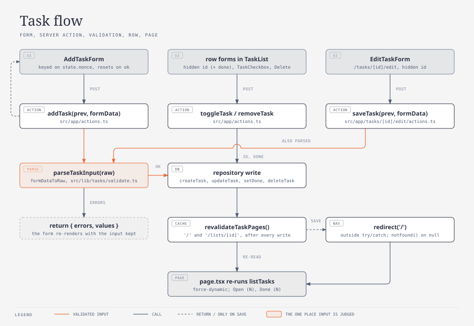
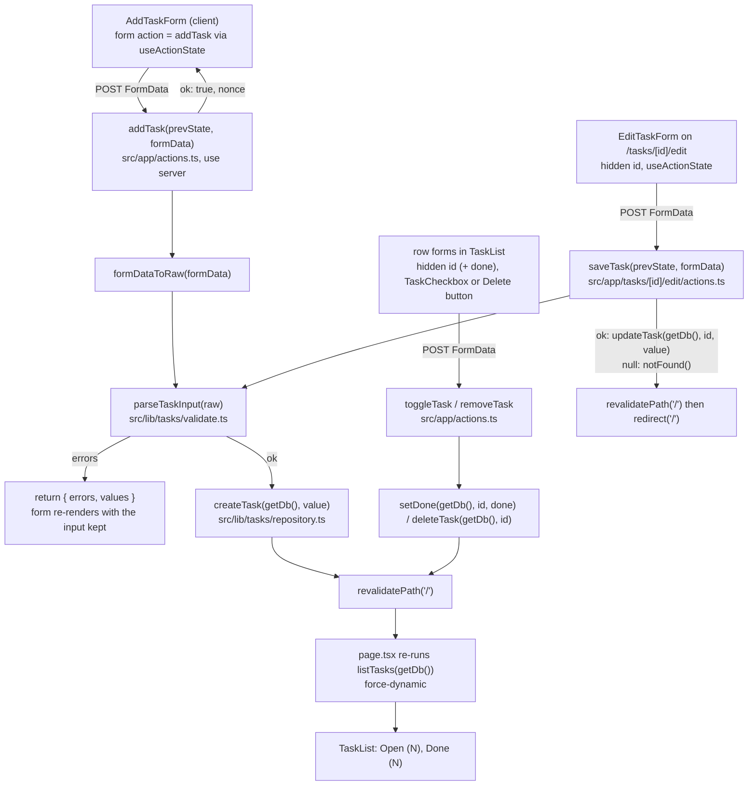

# Tasks

Tier 2. How the task list page reads tasks and how its forms write them: the path
from a form submit (add, done, reopen, delete, edit) through a server action, validation
in `src/lib`, the repository and back to a re-rendered list. For whoever is about to
change the list page, the edit page, a form, a validation message or a server action.

<!-- diagram: task-flow -->

## Key entry points

| Concern                                                       | Where                                                                                                                                                                                        |
| ------------------------------------------------------------- | -------------------------------------------------------------------------------------------------------------------------------------------------------------------------------------------- |
| The list page (reads on every request)                        | `src/app/page.tsx` → `Home`, `dynamic`; the body shared with `/lists/<id>` is `src/app/components/task-page.tsx` → `TaskPage` (see `how/lists.md`)                                           |
| The edit page (`params` is a Promise; 404 on unknown id)      | `src/app/tasks/[id]/edit/page.tsx` → `EditTaskPage`, `dynamic`                                                                                                                               |
| The add server action                                         | `src/app/actions.ts` → `addTask`, `AddTaskState`                                                                                                                                             |
| The done, reopen and delete server actions                    | `src/app/actions.ts` → `toggleTask`, `removeTask`                                                                                                                                            |
| The save server action (redirects to `/`)                     | `src/app/tasks/[id]/edit/actions.ts` → `saveTask`, `SaveTaskState`                                                                                                                           |
| The checkbox that submits its form on change                  | `src/app/components/task-checkbox.tsx` → `TaskCheckbox`                                                                                                                                      |
| The add form (client, `useActionState`)                       | `src/app/components/add-task-form.tsx` → `AddTaskForm`, `AddTaskFormView`                                                                                                                    |
| The four labelled fields shared by both forms                 | `src/app/components/task-fields.tsx` → `TaskFields`, `TaskFieldValues`, `TaskFieldErrors`                                                                                                    |
| The open and done lists                                       | `src/app/components/task-list.tsx` → `TaskList`                                                                                                                                              |
| The filter bar (links and search; see `how/scheduling.md`)    | `src/app/components/filter-bar.tsx` → `FilterBar`, `Show`                                                                                                                                    |
| The edit form (client, `useActionState`)                      | `src/app/components/edit-task-form.tsx` → `EditTaskForm`, `EditTaskFormView`                                                                                                                 |
| Reading and writing tasks                                     | `src/lib/tasks/repository.ts` → `listTasks`, `ListFilter`, `isOverdue`, `getTask`, `createTask`, `updateTask`, `setDone`, `deleteTask`                                                       |
| Validation rules and messages, and id/submitted-value parsing | `src/lib/tasks/validate.ts` → `parseTaskInput`, `parseDueOn`, `parsePriority`, `parseListId`, `PRIORITY_LABELS`, `formDataToRaw`, `parseTaskId`, `submittedValues`, `TITLE_MAX`, `NOTES_MAX` |
| The domain types                                              | `src/lib/tasks/types.ts` → `Task`, `TaskInput`, `Priority`                                                                                                                                   |
| Component tests of the forms                                  | `src/app/components/task-fields.test.tsx`, `src/app/components/add-task-form.test.tsx`, `src/app/components/edit-task-form.test.tsx`                                                         |
| End-to-end flow on a fresh database                           | `e2e/tasks.spec.ts`                                                                                                                                                                          |

## The page

`src/app/page.tsx` is a server component. It awaits `searchParams`, reads `show` and
`q` with `parseFilterQuery`, and renders `<TaskPage list={null} show q today />`.
`TaskPage` (`src/app/components/task-page.tsx`, shared with `/lists/<id>`, see
`how/lists.md`) calls `listTasks(getDb(), { show: show ?? "all", q, listId })` and
renders the sidebar (`ListsNav`), the `h2` heading (`All tasks` on `/`), `<AddTaskForm />`,
then `<FilterBar show={show} q={q} basePath="/" />` (the `Open`, `Done`, `All` links and
the `Search` form), then
`<TaskList open={open} done={done} show={show} q={q} today={today} />`.
Which sections render per `show`, the search, the ordering, the badges and the
`Overdue` mark are in `how/scheduling.md`; this page describes the default view (`/`
with no query). It exports `dynamic = "force-dynamic"`, so Next.js never prerenders it
and every request reads the database. The page keeps a single `h1` reading
`harness-demo` (the smoke test asserts it).

`TaskList` renders:

| State                        | Markup                                                                                                                                                                                                                                                                                                  |
| ---------------------------- | ------------------------------------------------------------------------------------------------------------------------------------------------------------------------------------------------------------------------------------------------------------------------------------------------------- |
| no tasks at all              | one paragraph: `No tasks yet. Add the first one above.`                                                                                                                                                                                                                                                 |
| open tasks                   | `h2` `Open (N)`, then a `ul` with accessible name `Open tasks`; each `li`: an unchecked checkbox `Mark done: <title>`, the title, the marks (`how/scheduling.md`), the first line of the notes in muted text when notes are non-empty, an `Edit` link to `/tasks/<id>/edit`, a `Delete: <title>` button |
| done tasks (only when N > 0) | `h2` `Done (N)`, then a `ul` with accessible name `Done tasks`; each `li`: a checked checkbox `Reopen: <title>`, the title with Tailwind `line-through`, the marks, a `Delete: <title>` button                                                                                                          |

Ordering comes from the repository, not the page: `open` is
`(due_on IS NULL) ASC, due_on ASC, priority ASC, created_at DESC, id DESC` (dated tasks
first by due date, then High before Normal before Low, then newest first), `done` is
`done_at DESC, id DESC` (most recently completed first); see `data-model.md`.

## The add form

`AddTaskForm` is a `"use client"` component: `useActionState(addTask, {})` gives it the
current `AddTaskState` and a form action; it renders `AddTaskFormView` with both. The view
is a plain `<form action={formAction}>` holding `<TaskFields idPrefix="add" />` and the
submit button.

`TaskFields({ idPrefix, values, errors })` in `src/app/components/task-fields.tsx` is the
one place the task controls are written; the add and edit forms both render it, so a new
field is added there once. It has no server imports (only `PRIORITY_LABELS` from
`src/lib/tasks/validate.ts`), so it renders inside `"use client"` forms. `idPrefix`
(`add` or `edit`) prefixes every control id, so two forms on one page never share one.

| Field    | Control                                                                                         | Accessible name |
| -------- | ----------------------------------------------------------------------------------------------- | --------------- |
| title    | `input name="title"`, placeholder `What needs doing?`                                           | `Title`         |
| notes    | `textarea name="notes"`                                                                         | `Notes`         |
| dueOn    | `input type="date" name="dueOn"`, value `YYYY-MM-DD` or empty                                   | `Due`           |
| priority | `select name="priority"`, options `1` High, `2` Normal, `3` Low (labels from `PRIORITY_LABELS`) | `Priority`      |
| submit   | `button` `Add task` (add form) or `Save` (edit form)                                            |                 |

`values` is `{ title, notes, dueOn, priority }` as strings, exactly the shape
`submittedValues` returns; the add form passes `state.values` or, before any submit,
`{ title: "", notes: "", dueOn: "", priority: "2" }` (so Normal is preselected).
`defaultValue` of each control comes from those values, so after a validation error the
submitted input stays in every field. The form element is keyed on `state.nonce`; a
successful add returns a new nonce, React remounts the form, and all fields are back to
their defaults. Each error renders under its field in a `
`.

`AddTaskFormView` takes `state` and `action` as props so the component test renders it
directly with a hand-made state and never touches a server action or a database.

## Done, reopen and delete

Each row carries two small forms rendered by the server component `TaskList`; the
arguments travel as hidden inputs, so there is no client state and no JavaScript beyond
the checkbox:

| Control                                             | Form                                                           | Action                        |
| --------------------------------------------------- | -------------------------------------------------------------- | ----------------------------- |
| checkbox, accessible name `Mark done: <title>`      | `action={toggleTask}`, hidden `id=<id>`, hidden `done="true"`  | `setDone(getDb(), id, true)`  |
| checked checkbox, accessible name `Reopen: <title>` | `action={toggleTask}`, hidden `id=<id>`, hidden `done="false"` | `setDone(getDb(), id, false)` |
| button, accessible name `Delete: <title>`           | `action={removeTask}`, hidden `id=<id>`                        | `deleteTask(getDb(), id)`     |

The accessible names come from `aria-label` and are exactly `Mark done: <title>`,
`Reopen: <title>` and `Delete: <title>`; the e2e test locates controls by them.

`TaskCheckbox` (`"use client"`) is the only client code in a row: on `change` it calls
`event.currentTarget.form?.requestSubmit()`, which submits the enclosing form and so runs
its server action. `toggleTask(formData)` and `removeTask(formData)` return `void`: they
read `id` (a positive integer string; anything else is ignored) and, for toggle, `done`
(`"true"` means mark done, anything else means reopen), call the repository once and then
`revalidateTaskPages()` (`revalidatePath("/")` and `revalidatePath("/lists/[id]", "page")`). An unknown `id` is a silent no-op: `setDone` returns `null` and
`deleteTask` returns `false`, and the page re-renders from the database either way.

## The add server action

`addTask(prevState, formData)` in `src/app/actions.ts` (`"use server"`):

1. `parseTaskInput(formDataToRaw(formData), { listIds })`, with `listIds` from
   `listLists(getDb())`, so the hidden `listId` a list page sends must be an existing list.
2. On `ok: false`: return `{ errors, values }` where `values` are the submitted strings
   (non-string form values become `""`). Nothing is written.
3. On `ok: true`: `createTask(getDb(), value)`, then `revalidatePath("/")` and
   `revalidatePath("/lists/[id]", "page")` (`revalidateTaskPages`), then return
   `{ nonce: Date.now() }`.

`AddTaskState` is `{ errors?: TaskInputErrors; values?: { title, notes, dueOn, priority }; nonce? }`
(`values` is the return type of `submittedValues`).

The validation messages, produced only in `src/lib/tasks/validate.ts`:

| Field      | Rule                                                                                                                                                                                                | Message                                   |
| ---------- | --------------------------------------------------------------------------------------------------------------------------------------------------------------------------------------------------- | ----------------------------------------- |
| `title`    | trimmed, 1 to 200 characters                                                                                                                                                                        | `Title is required.` when empty           |
| `title`    |                                                                                                                                                                                                     | `Title must be 200 characters or fewer.`  |
| `notes`    | trimmed, 0 to 2000 characters                                                                                                                                                                       | `Notes must be 2000 characters or fewer.` |
| `dueOn`    | trimmed; empty or missing is `null`; else `YYYY-MM-DD` and a real calendar date                                                                                                                     | `Due must be a date (YYYY-MM-DD).`        |
| `priority` | missing, `null` or `""` is `2`; else `"1"`, `"2"`, `"3"` (or the number)                                                                                                                            | `Priority must be high, normal or low.`   |
| `listId`   | missing, `null` or `""` is `null`; else a positive integer (`parseTaskId`) that is in `options.listIds` when `parseTaskInput(raw, { listIds })` is given them; without options any positive integer | `List does not exist.`                    |

`parseTaskInput` reports every failing field at once (`TaskInputErrors` has `title`,
`notes`, `dueOn`, `priority`, `listId`). Both forms send the title, notes, due and
priority fields; an empty `dueOn` stores `null` and the select always sends a priority,
`2` unless changed. `formDataToRaw` and `submittedValues` also read `listId` (`""` when
the form has no such field, which parses to `null`).

`getDb()` is imported only in the `page.tsx` files, `TaskPage` and the `actions.ts` files;
client components receive plain data (`Task[]`) or the action function as props, so no
`"use client"` file imports `@/lib/db`.

## The edit page

`/tasks/<id>/edit` is `src/app/tasks/[id]/edit/page.tsx`, a server component with
`dynamic = "force-dynamic"`. `params` is a Promise in Next.js 16, so the page does
`const { id } = await params`. The rule for the id:

| `id` in the URL                         | Result                                                    |
| --------------------------------------- | --------------------------------------------------------- |
| a positive integer string with a task   | 200, `EditTaskForm` prefilled from `getTask(getDb(), id)` |
| a positive integer string, no such task | `notFound()`, the Next.js 404 page with HTTP status 404   |
| anything else (`abc`, `0`, `-1`, `1.5`) | `notFound()`, HTTP status 404                             |

`EditTaskForm` (`"use client"`) is `useActionState(saveTask, {})` over `EditTaskFormView`:
a hidden `id`, `<TaskFields idPrefix="edit" />` (Title, Notes, Due, Priority), a `Save`
button and a `Cancel` link to `/`. The values come from `state.values` when the last save
failed validation, otherwise from the `task` prop as
`{ title, notes, dueOn: task.dueOn ?? "", priority: String(task.priority) }`, so the user's
input survives an error and the first render shows the stored values.

`saveTask(prevState, formData)` in `src/app/tasks/[id]/edit/actions.ts`:

1. Reads `id` from the hidden input; not a positive integer: `notFound()`.
2. `parseTaskInput(formDataToRaw(formData))`; on `ok: false` returns `{ errors, values }`
   and the form re-renders on the edit page with the message under the field. Nothing
   is written.
3. `updateTask(getDb(), id, value)`; `null` (the task was deleted meanwhile): `notFound()`.
4. `revalidatePath("/")`, then `redirect("/")`. The list shows the new title and notes.

`redirect` and `notFound` work by throwing, which is why `saveTask` has no `try/catch`
around them: a `catch` would swallow the redirect and the page would stay put.

## Tests

| Tier      | File                                         | Proves                                                                                                                                                                                                                                                                                                                                                                                                                                                                                                                                  |
| --------- | -------------------------------------------- | --------------------------------------------------------------------------------------------------------------------------------------------------------------------------------------------------------------------------------------------------------------------------------------------------------------------------------------------------------------------------------------------------------------------------------------------------------------------------------------------------------------------------------------- |
| component | `src/app/components/task-fields.test.tsx`    | the four labels, `type="date"` on Due, the three priority options with Normal selected; values prefill every control; one `role="alert"` per field error in field order; ids carry `idPrefix`                                                                                                                                                                                                                                                                                                                                           |
| component | `src/app/components/add-task-form.test.tsx`  | labels, placeholder and button render with Due empty and Priority `2`; error state renders one `role="alert"` per field and keeps values, Due and Priority included; a new nonce clears the form                                                                                                                                                                                                                                                                                                                                        |
| component | `src/app/components/edit-task-form.test.tsx` | Title, Notes, Due and Priority prefilled from the task (an undated Normal task shows empty Due and Normal), Save button, Cancel link to `/`; error state renders the alert and keeps the submitted values                                                                                                                                                                                                                                                                                                                               |
| e2e       | `e2e/tasks.spec.ts`                          | empty state on a fresh database; adding `Buy milk` shows it first under `Open (1)` and clears the form; an empty title shows `Title is required.` and adds nothing; `Mark done: Buy milk` moves it under `Done (1)` struck through with `Open (0)`; `Reopen: Buy milk` moves it back; `Delete: Buy milk` returns the empty state; the edit page changes the title to `Buy oat milk` and notes to `2 litres` and the list shows both; an empty title on the edit page shows the error and changes nothing; `/tasks/999999/edit` is a 404 |

The e2e file is one serial flow (`test.describe.configure({ mode: "serial" })`) on the
run's fresh `data/e2e-<timestamp>.db`.

## Failure modes

| Symptom                                                                         | Cause                                                                                                                  | Fix                                                                                                        |
| ------------------------------------------------------------------------------- | ---------------------------------------------------------------------------------------------------------------------- | ---------------------------------------------------------------------------------------------------------- |
| the list does not change after an add                                           | `revalidatePath("/")` missing in the action, or the page was prerendered                                               | keep `revalidatePath("/")` after every write and `dynamic = "force-dynamic"` on the page                   |
| the form keeps the old text after a successful add                              | the form is not remounted                                                                                              | keep `key={state.nonce}` on the `<form>` and return a new `nonce` from the action on success               |
| the form loses its text after a validation error                                | `values` not returned from the action, or `defaultValue` not wired to `state.values`                                   | return the submitted strings in `values`; read them in `defaultValue`                                      |
| `pnpm build` fails on `node:sqlite` in a client component                       | a `"use client"` component imported `@/lib/db` or the repository                                                       | call `getDb()` only in `page.tsx` and `actions.ts`; pass data as props                                     |
| `useActionState` type error on the action                                       | the action signature is not `(prevState: AddTaskState, formData: FormData) => Promise<AddTaskState>`                   | keep the two-argument signature; `useActionState` passes the previous state first                          |
| clicking a checkbox changes nothing                                             | the checkbox is outside its form, or `requestSubmit()` was replaced by `submit()`, which skips React's action handling | keep `TaskCheckbox` inside the `<form action={toggleTask}>` and keep `requestSubmit()`                     |
| a task toggles the wrong way                                                    | the hidden `done` value does not match the row's section                                                               | open rows submit `done="true"`, done rows submit `done="false"` (`ToggleForm` in `task-list.tsx`)          |
| saving a valid edit shows the list unchanged and stays on the edit page         | `redirect("/")` was wrapped in `try/catch` and the thrown redirect was swallowed                                       | keep `redirect` and `notFound` outside any `try` block in `saveTask`                                       |
| the edit page renders for a deleted task, or the id reads as `[object Promise]` | `params` was used without `await`                                                                                      | `const { id } = await params` in `EditTaskPage`                                                            |
| the edit form shows the old text after a validation error                       | `defaultValue` reads only from the `task` prop                                                                         | read `state.values ?? task` (`EditTaskFormView`)                                                           |
| a field renders in one form but not the other                                   | the control was added to a form file instead of `TaskFields`                                                           | add controls only in `src/app/components/task-fields.tsx`; both forms render it                            |
| e2e sees rows from an earlier run                                               | `DATABASE_PATH` was set explicitly to a reused file                                                                    | unset it; `playwright.config.ts` picks `data/e2e-<timestamp>.db` per run; `rm -f data/e2e-*.db*` cleans up |
