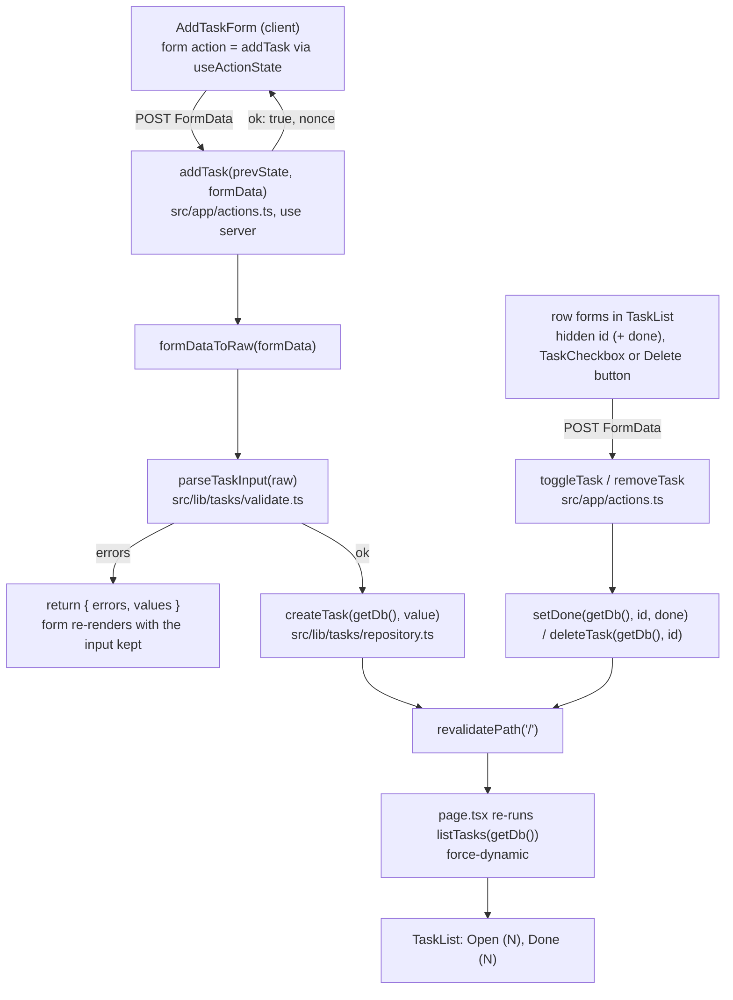

# Tasks

Tier 2. How the task list page reads tasks and how the add form writes one: the path
from a form submit through a server action, validation in `src/lib`, the repository and
back to a re-rendered list. For whoever is about to change the list page, the add form,
a validation message or a server action.

<!-- diagram: task-flow -->

## Key entry points

| Concern                                      | Where                                                                                     |
| -------------------------------------------- | ----------------------------------------------------------------------------------------- |
| The list page (reads on every request)       | `src/app/page.tsx` → `Home`, `dynamic`                                                    |
| The add server action                        | `src/app/actions.ts` → `addTask`, `AddTaskState`                                          |
| The done, reopen and delete server actions   | `src/app/actions.ts` → `toggleTask`, `removeTask`                                         |
| The checkbox that submits its form on change | `src/app/components/task-checkbox.tsx` → `TaskCheckbox`                                   |
| The add form (client, `useActionState`)      | `src/app/components/add-task-form.tsx` → `AddTaskForm`, `AddTaskFormView`                 |
| The open and done lists                      | `src/app/components/task-list.tsx` → `TaskList`                                           |
| Reading and writing tasks                    | `src/lib/tasks/repository.ts` → `listTasks`, `createTask`, `setDone`, `deleteTask`        |
| Validation rules and messages                | `src/lib/tasks/validate.ts` → `parseTaskInput`, `formDataToRaw`, `TITLE_MAX`, `NOTES_MAX` |
| The domain types                             | `src/lib/tasks/types.ts` → `Task`, `TaskInput`                                            |
| Component test of the form                   | `src/app/components/add-task-form.test.tsx`                                               |
| End-to-end flow on a fresh database          | `e2e/tasks.spec.ts`                                                                       |

## The page

`src/app/page.tsx` is a server component. It calls `listTasks(getDb())` and renders
`<AddTaskForm />` followed by `<TaskList open={open} done={done} />`. It exports
`dynamic = "force-dynamic"`, so Next.js never prerenders it and every request reads the
database. The page keeps a single `h1` reading `harness-demo` (the smoke test asserts it).

`TaskList` renders:

| State                        | Markup                                                                                                                                                                                                                                                                 |
| ---------------------------- | ---------------------------------------------------------------------------------------------------------------------------------------------------------------------------------------------------------------------------------------------------------------------- |
| no tasks at all              | one paragraph: `No tasks yet. Add the first one above.`                                                                                                                                                                                                                |
| open tasks                   | `h2` `Open (N)`, then a `ul` with accessible name `Open tasks`; each `li`: an unchecked checkbox `Mark done: <title>`, the title, the first line of the notes in muted text when notes are non-empty, an `Edit` link to `/tasks/<id>/edit`, a `Delete: <title>` button |
| done tasks (only when N > 0) | `h2` `Done (N)`, then a `ul` with accessible name `Done tasks`; each `li`: a checked checkbox `Reopen: <title>`, the title with Tailwind `line-through`, a `Delete: <title>` button                                                                                    |

Ordering comes from the repository, not the page: `open` is `created_at DESC, id DESC`
(newest first), `done` is `done_at DESC, id DESC` (most recently completed first).

## The add form

`AddTaskForm` is a `"use client"` component: `useActionState(addTask, {})` gives it the
current `AddTaskState` and a form action; it renders `AddTaskFormView` with both. The view
is a plain `<form action={formAction}>` with:

| Field  | Control                                               | Accessible name |
| ------ | ----------------------------------------------------- | --------------- |
| title  | `input name="title"`, placeholder `What needs doing?` | `Title`         |
| notes  | `textarea name="notes"`                               | `Notes`         |
| submit | `button` `Add task`                                   |                 |

`defaultValue` of each control comes from `state.values`, so after a validation error the
submitted text stays in the field. The form element is keyed on `state.nonce`; a
successful add returns a new nonce, React remounts the form, and both fields are empty
again. Error text renders under its field in a `
`.

`AddTaskFormView` takes `state` and `action` as props so the component test renders it
directly with a hand-made state and never touches a server action or a database.

## Done, reopen and delete

Each row carries two small forms rendered by the server component `TaskList`; the
arguments travel as hidden inputs, so there is no client state and no JavaScript beyond
the checkbox:

| Control                                             | Form                                                           | Action                        |
| --------------------------------------------------- | -------------------------------------------------------------- | ----------------------------- |
| checkbox, accessible name `Mark done: <title>`      | `action={toggleTask}`, hidden `id=<id>`, hidden `done="true"`  | `setDone(getDb(), id, true)`  |
| checked checkbox, accessible name `Reopen: <title>` | `action={toggleTask}`, hidden `id=<id>`, hidden `done="false"` | `setDone(getDb(), id, false)` |
| button, accessible name `Delete: <title>`           | `action={removeTask}`, hidden `id=<id>`                        | `deleteTask(getDb(), id)`     |

The accessible names come from `aria-label` and are exactly `Mark done: <title>`,
`Reopen: <title>` and `Delete: <title>`; the e2e test locates controls by them.

`TaskCheckbox` (`"use client"`) is the only client code in a row: on `change` it calls
`event.currentTarget.form?.requestSubmit()`, which submits the enclosing form and so runs
its server action. `toggleTask(formData)` and `removeTask(formData)` return `void`: they
read `id` (a positive integer string; anything else is ignored) and, for toggle, `done`
(`"true"` means mark done, anything else means reopen), call the repository once and then
`revalidatePath("/")`. An unknown `id` is a silent no-op: `setDone` returns `null` and
`deleteTask` returns `false`, and the page re-renders from the database either way.

## The add server action

`addTask(prevState, formData)` in `src/app/actions.ts` (`"use server"`):

1. `parseTaskInput(formDataToRaw(formData))`.
2. On `ok: false`: return `{ errors, values }` where `values` are the submitted strings
   (non-string form values become `""`). Nothing is written.
3. On `ok: true`: `createTask(getDb(), value)`, then `revalidatePath("/")`, then return
   `{ ok: true, nonce: Date.now() }`.

`AddTaskState` is `{ errors?: { title?, notes? }; values?: { title, notes }; ok?; nonce? }`.

The validation messages, produced only in `src/lib/tasks/validate.ts`:

| Field   | Rule                          | Message                                   |
| ------- | ----------------------------- | ----------------------------------------- |
| `title` | trimmed, 1 to 200 characters  | `Title is required.` when empty           |
| `title` |                               | `Title must be 200 characters or fewer.`  |
| `notes` | trimmed, 0 to 2000 characters | `Notes must be 2000 characters or fewer.` |

`getDb()` is imported only in `page.tsx` and `actions.ts`. Components receive plain data
(`Task[]`) or the action function; no `"use client"` file imports `@/lib/db`.

## Tests

| Tier      | File                                        | Proves                                                                                                                                                                                                                                                                                                                           |
| --------- | ------------------------------------------- | -------------------------------------------------------------------------------------------------------------------------------------------------------------------------------------------------------------------------------------------------------------------------------------------------------------------------------- |
| component | `src/app/components/add-task-form.test.tsx` | labels, placeholder and button render; error state renders one `role="alert"` per field and keeps values                                                                                                                                                                                                                         |
| e2e       | `e2e/tasks.spec.ts`                         | empty state on a fresh database; adding `Buy milk` shows it first under `Open (1)` and clears the form; an empty title shows `Title is required.` and adds nothing; `Mark done: Buy milk` moves it under `Done (1)` struck through with `Open (0)`; `Reopen: Buy milk` moves it back; `Delete: Buy milk` returns the empty state |

The e2e file is one serial flow (`test.describe.configure({ mode: "serial" })`) on the
run's fresh `data/e2e-<timestamp>.db`.

## Failure modes

| Symptom                                                   | Cause                                                                                                                  | Fix                                                                                                        |
| --------------------------------------------------------- | ---------------------------------------------------------------------------------------------------------------------- | ---------------------------------------------------------------------------------------------------------- |
| the list does not change after an add                     | `revalidatePath("/")` missing in the action, or the page was prerendered                                               | keep `revalidatePath("/")` after every write and `dynamic = "force-dynamic"` on the page                   |
| the form keeps the old text after a successful add        | the form is not remounted                                                                                              | keep `key={state.nonce}` on the `<form>` and return a new `nonce` from the action on success               |
| the form loses its text after a validation error          | `values` not returned from the action, or `defaultValue` not wired to `state.values`                                   | return the submitted strings in `values`; read them in `defaultValue`                                      |
| `pnpm build` fails on `node:sqlite` in a client component | a `"use client"` component imported `@/lib/db` or the repository                                                       | call `getDb()` only in `page.tsx` and `actions.ts`; pass data as props                                     |
| `useActionState` type error on the action                 | the action signature is not `(prevState: AddTaskState, formData: FormData) => Promise<AddTaskState>`                   | keep the two-argument signature; `useActionState` passes the previous state first                          |
| clicking a checkbox changes nothing                       | the checkbox is outside its form, or `requestSubmit()` was replaced by `submit()`, which skips React's action handling | keep `TaskCheckbox` inside the `<form action={toggleTask}>` and keep `requestSubmit()`                     |
| a task toggles the wrong way                              | the hidden `done` value does not match the row's section                                                               | open rows submit `done="true"`, done rows submit `done="false"` (`ToggleForm` in `task-list.tsx`)          |
| e2e sees rows from an earlier run                         | `DATABASE_PATH` was set explicitly to a reused file                                                                    | unset it; `playwright.config.ts` picks `data/e2e-<timestamp>.db` per run; `rm -f data/e2e-*.db*` cleans up |
